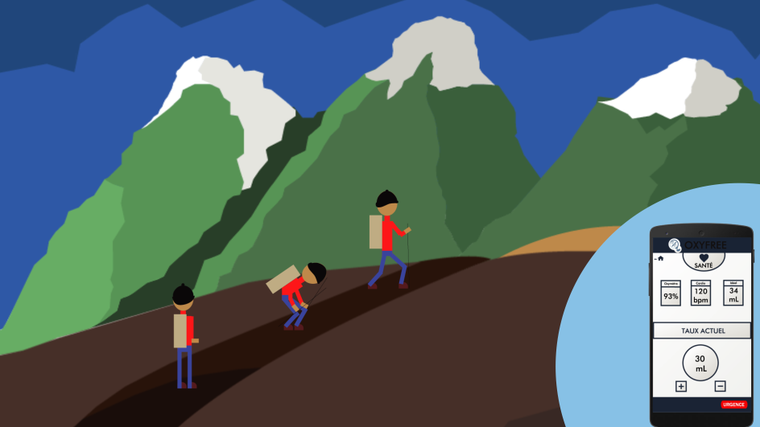

# Oxylib

Projet DIY visant à permettre le contrôle du débit d'une bouteille d'oxygène portative à l'aide du Bluetooth low energy

## Concept

## Périphériques

- [Arduino33BLE]()
- [Esp32]()
- [M5Stack]()

## Clients

- [Android Wear]()
- [PWA]()